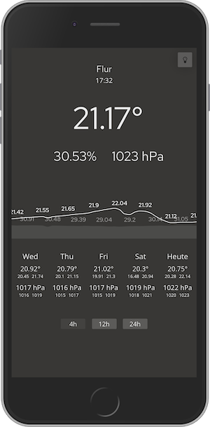

# ESP32 Microcontroller Weather Station
I used VS Code PlatformIO for compiling and falshing software to the ESP32
On some Systems you have to press and hold the Boot Button on the ESP32 dev board, otherwise connection for flashing may fail.

There are two different "configurations" in this project. The first, "Weather Sensor" consists only of ESP32 and a BME280 Sensor. The "Weather Station" adds an OLED Display where currently measured data is displayed.

## Weather Sensor
Hardware:
- ESP32 Node MCU
- I2C BME280 (temperature, pressure, humidity)

I2C Pins: G21 Clock, G22 Data
Vcc: 3,3V

The sensor software sets the ESP32 to deepsleep. A timer interrupt wakes the controller every 5 minutes which then performs a measurement, sends the data to the "Weather Server" and sets the controller back to sleep then.

## Weather Station
Hardware:
- ESP32 Node MCU
- I2C BME280 (temperature, pressure, humidity)
- I2C 128x32 OLED Display
- Jumper wire as Touch Interface (G15)

I2C Pins: G21 Clock, G22 Data
Vcc: 3,3V

The station software is a more advanced version of the sensor software version. It is extended with an OLED display (connected to the same I2C Pins as the BME Sensor) which is used for displaying the currently measured temperature, pressure an humidity of the environment.
It comes with a second interrupt. It's fired when the Jumper Wire on pin G15 is touched. Then the the OLED is activated.
When the Timer interrupt is called the OLED stays off.

# Weather Server
### Receiving Data
The Weather Server consists of a php-script interface (write_data.php) which the data of the ESP32 Sensors is sent to. It writes the received data to a sepereate csv for each sensor.

### Statistics / Historics Calculation
Furthermore there is a python script (calculate_day_hists.py) which calculates the day (24h) averages, min and maxes for temperature, pressure, humidity. It runs once a day, triggered by a cron job. the calculations are written to another csv, each sepererate for each sensor

### Visualization
The index.php displays the recorded data from the csv's.
It automatically draws a swipable container for each sensor-specific csv file.

